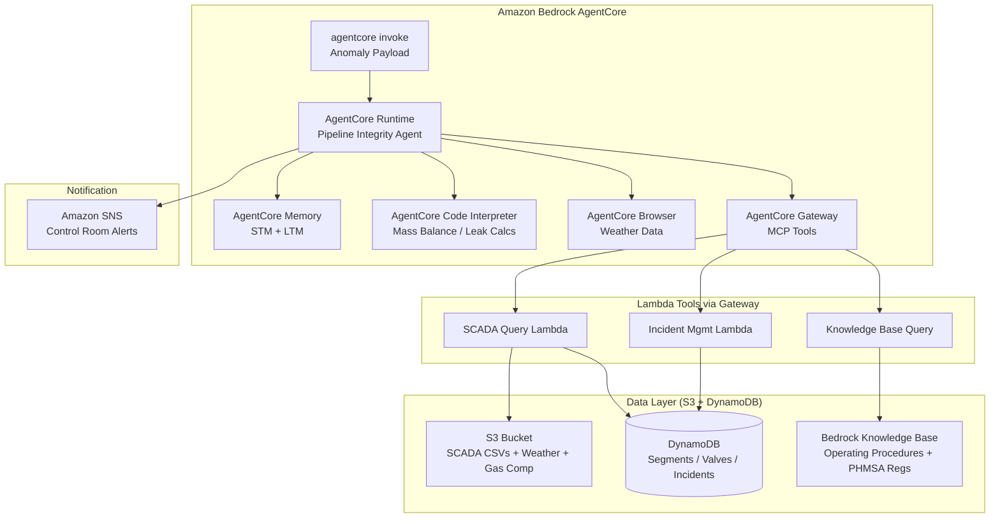
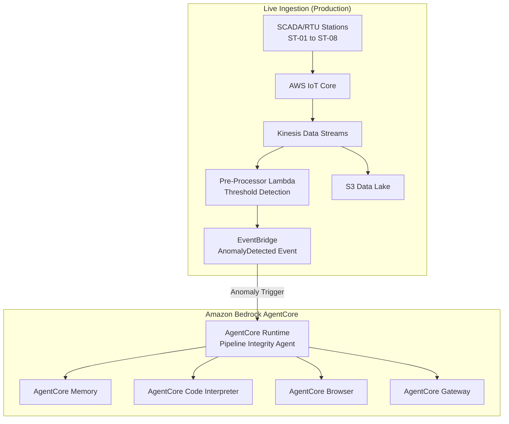
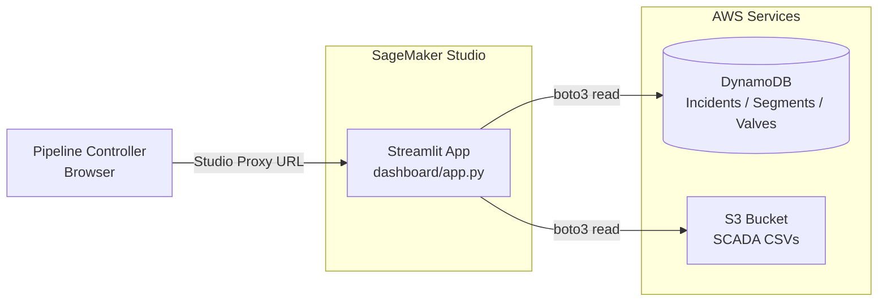

# Design Document — Pipeline Leak Detection & Integrity Agent

## Overview

This document describes the technical design for an autonomous Pipeline Integrity Agent built with the Strands Agents SDK and deployed on Amazon Bedrock AgentCore. The agent monitors SCADA telemetry from 8 stations across a 200-mile natural gas pipeline, disambiguates real leaks from operational transients, localizes confirmed leaks, assesses severity, and orchestrates incident response — all within a 5-minute response window.

The agent uses AgentCore's managed infrastructure: Runtime for hosting, Memory for operational baselines and session context, Code Interpreter for physics calculations, Gateway for tool access via MCP, and Browser for live weather data.

## Architecture

### Demo Architecture (Hackathon)

For the hackathon, SCADA data is pre-recorded in CSV files stored in S3. The agent is invoked directly via `agentcore invoke` with an anomaly payload simulating what EventBridge would send in production. No IoT Core or Kinesis is needed.



### Production Reference Architecture (Future)

In production, live SCADA telemetry flows through IoT Core → Kinesis → a pre-processor Lambda that detects threshold breaches and fires EventBridge events to trigger the agent automatically.



## Components and Interfaces

### 1. Agent Core (Strands Agent)

The main agent is a Strands `Agent` instance with a system prompt encoding pipeline controller expertise. It uses the `@tool` decorator pattern for custom tools and connects to AgentCore Gateway for Lambda-backed MCP tools.

```python
from strands import Agent
from strands_tools.code_interpreter import AgentCoreCodeInterpreter
from bedrock_agentcore.runtime import BedrockAgentCoreApp
from bedrock_agentcore.memory import MemoryClient

app = BedrockAgentCoreApp()

agent = Agent(
    model="us.anthropic.claude-sonnet-4-6-20250514-v1:0",
    system_prompt=PIPELINE_INTEGRITY_SYSTEM_PROMPT,
    tools=[...],  # Custom tools + Code Interpreter + Gateway MCP tools
    hooks=[MemoryHook()]
)

@app.entrypoint
def invoke(payload: dict, context) -> str:
    """Entry point triggered by EventBridge anomaly events."""
    ...
```

### 2. Custom Tools (Strands @tool pattern)

| Tool Name | Purpose | Implementation |
|---|---|---|
| `query_scada_readings` | Fetch recent SCADA data for specified stations/time range | Lambda via Gateway |
| `query_station_metadata` | Get pipeline segment specs, valve locations | Lambda via Gateway |
| `check_compressor_events` | Check compressor start/stop logs in time window | Lambda via Gateway |
| `check_valve_changes` | Check valve position changes in time window | Lambda via Gateway |
| `get_weather_data` | Fetch current ambient temperature and conditions | AgentCore Browser |
| `run_mass_balance_calc` | Execute mass balance calculation in Code Interpreter | AgentCore Code Interpreter |
| `run_leak_localization` | Estimate leak mile marker using pressure gradients | AgentCore Code Interpreter |
| `run_line_pack_correction` | Calculate temperature-corrected line pack | AgentCore Code Interpreter |
| `create_incident` | Create incident record in DynamoDB | Lambda via Gateway |
| `send_alert` | Publish alert to SNS control room topic | Lambda via Gateway |
| `query_knowledge_base` | Search operating procedures and PHMSA regulations | Bedrock KB via Gateway |
| `get_operational_baseline` | Retrieve per-station baselines from LTM | AgentCore Memory |
| `store_event_signature` | Store false positive or leak signature in LTM | AgentCore Memory |

### 3. AgentCore Runtime Configuration

Deployment uses the AgentCore CLI (`agentcore configure` + `agentcore deploy`):

```bash
# Configure agent with memory and Code Interpreter
agentcore configure -e agent.py

# Deploy to AgentCore Runtime (builds container, pushes to ECR, creates runtime)
agentcore deploy
```

The CLI auto-creates IAM roles, ECR repos, and memory resources. Configuration is stored in `.bedrock_agentcore.yaml`:

```yaml
# .bedrock_agentcore.yaml (auto-generated by agentcore configure)
entrypoint: agent.py
requirements: requirements.txt
runtime:
  python_version: "3.13"
memory:
  enabled: true
  long_term_memory: true
environment:
  AWS_DEFAULT_REGION: us-west-2
  GATEWAY_URL: <gateway-mcp-url>
  SNS_TOPIC_ARN: <control-room-topic-arn>
  KNOWLEDGE_BASE_ID: <kb-id>
  SCADA_BUCKET: pipeline-data-<account-id>
```

Key packages in `requirements.txt`:
```
strands-agents
bedrock-agentcore
strands-agents-tools
boto3
```

### 4. AgentCore Memory Design

**Short-Term Memory (STM):**
- Stores the full investigation context within a single anomaly session
- Includes all SCADA readings checked, calculations performed, decisions made
- Expires after 7 days

**Long-Term Memory (LTM):**
- Strategies:
  - `semantic` — stores operational baselines per station (normal pressure/flow ranges, seasonal patterns)
  - `user_preference` — stores learned false positive signatures and disambiguation patterns
- Namespace: `/pipeline/{station_id}/baselines/` and `/pipeline/incidents/`
- Event expiry: 365 days

### 5. AgentCore Gateway Configuration

The Gateway exposes Lambda tools as MCP endpoints with IAM authorization:

| Target Name | Type | Lambda Function | Tools Exposed |
|---|---|---|---|
| `ScadaQuery` | Lambda | `pipeline-scada-query` | `query_scada_readings`, `check_compressor_events`, `check_valve_changes`, `query_station_metadata` |
| `IncidentMgmt` | Lambda | `pipeline-incident-mgmt` | `create_incident`, `send_alert` |
| `ValveControl` | Lambda | `pipeline-valve-control` | `close_isolation_valve`, `get_valve_status` |
| `KnowledgeBase` | Bedrock KB | N/A | `query_knowledge_base` |

### 6. EventBridge Trigger Rules

```json
{
  "source": ["pipeline.scada"],
  "detail-type": ["AnomalyDetected"],
  "detail": {
    "anomaly_type": ["pressure_drop", "mass_balance_deficit", "flow_imbalance"],
    "severity": ["warning", "critical"]
  }
}
```

Trigger conditions (evaluated by a lightweight Lambda pre-processor on Kinesis):
- Mass balance deficit > 0.3 MMSCFD sustained for 2+ consecutive readings
- Pressure drop rate > 1.5 PSI/min sustained over 5 minutes
- Flow imbalance > 5% between adjacent stations

## Data Models

### Anomaly Event (EventBridge payload → Agent input)

```python
@dataclass
class AnomalyEvent:
    event_id: str                    # Unique anomaly trigger ID
    timestamp: str                   # ISO 8601
    anomaly_type: str                # pressure_drop | mass_balance_deficit | flow_imbalance
    affected_stations: list[str]     # e.g. ["ST-05", "ST-06"]
    affected_segment: str            # e.g. "SEG-05"
    trigger_values: dict             # Key metrics that triggered the event
    severity: str                    # warning | critical
```

### SCADA Reading

```python
@dataclass
class ScadaReading:
    timestamp: str
    station_id: str
    station_type: str               # compressor | meter | custody_transfer
    pressure_psi: float
    pressure_upstream_psi: float
    flow_mmscfd: float
    flow_direction: str             # inlet | outlet
    temperature_f: float
    compressor_status: str          # running | standby | shutdown
    compressor_speed_rpm: int
    valve_position_pct: float
    line_pack_mmscf: float
    mass_balance_deficit_mmscfd: float
    event_flag: str                 # normal | compressor_start | valve_change | leak | false_positive
```

### Pipeline Segment

```python
@dataclass
class PipelineSegment:
    segment_id: str
    from_station: str
    to_station: str
    length_miles: float
    diameter_in: float
    wall_thickness_in: float
    material_grade: str
    max_operating_pressure_psi: float
    elevation_start_ft: float
    elevation_end_ft: float
    valve_locations_mile_markers: list[float]
    maop_psi: float
```

### Incident Report

```python
@dataclass
class IncidentReport:
    incident_id: str                # e.g. "INC-2026-0847"
    timestamp: str
    response_time_seconds: int
    anomaly_analysis: dict          # Pressure/flow readings and deviations
    false_positive_check: dict      # Compressor, valve, weather checks performed
    classification: str             # real_leak | false_positive
    leak_localization: dict | None  # Segment, mile marker range, confidence
    severity: str | None            # seep | moderate | significant | near_rupture
    leak_rate_mmscfd: float | None
    phmsa_reportable: bool
    recommended_actions: list[str]
    draft_notification: str | None  # Pre-filled PHMSA Form 7100.1 content
    status: str                     # open | investigating | resolved
```

### Operational Baseline (stored in LTM)

```python
@dataclass
class StationBaseline:
    station_id: str
    normal_pressure_range_psi: tuple[float, float]
    normal_flow_range_mmscfd: tuple[float, float]
    typical_line_pack_mmscf: float
    seasonal_adjustment: str        # winter | summer | transition
    last_updated: str
```

## Data Ingestion Strategy

### SCADA CSV Data → S3 + DynamoDB

The SCADA time-series CSV and supporting CSVs (pipeline segments, gas composition, labeled events, valve status, weather) are loaded into S3 as the data lake. A setup script uploads them and populates DynamoDB tables for fast query access by the agent's Lambda tools.

```
data/
├── scada_timeseries.csv          → S3: s3://pipeline-data-{account}/scada/
├── pipeline_segment_metadata.csv → DynamoDB: PipelineSegments table
├── gas_composition.csv           → S3: s3://pipeline-data-{account}/gas-composition/
├── labeled_leak_events.csv       → DynamoDB: LabeledEvents table (for validation)
├── labeled_false_positive_events.csv → DynamoDB: LabeledEvents table
├── valve_status.csv              → DynamoDB: ValveStatus table
├── weather_conditions.csv        → S3: s3://pipeline-data-{account}/weather/
├── cathodic_protection.csv       → S3: s3://pipeline-data-{account}/integrity/
├── inspection_history.csv        → S3: s3://pipeline-data-{account}/integrity/
└── row_encroachment.csv          → S3: s3://pipeline-data-{account}/integrity/
```

The SCADA query Lambda reads from S3 (using Athena or direct pandas reads for the demo) and DynamoDB for metadata lookups. For the hackathon demo, the Lambda can load CSVs directly from S3 into memory since the dataset is 90 days × 8 stations.

#### Scaling the Dataset

| Dataset Size | Query Strategy | Changes Needed |
|---|---|---|
| < 100 MB (current: 21 MB) | Lambda loads CSV with pandas directly from S3 | None — works as-is |
| 100 MB – 1 GB | Amazon Athena SQL queries over S3 | Convert CSV → Parquet, create Glue table, Lambda calls Athena |
| > 1 GB | Athena + S3 partitioning by date/station | Partition S3 by `year/month/day/station_id/`, Glue partitioned table |

To scale: convert SCADA CSV to Parquet, partition by date, and update the Lambda tool to use Athena queries instead of pandas. The agent's interface (tool schema) stays the same — only the Lambda implementation changes.

### PDF Reference Documents → Bedrock Knowledge Base

The operating procedures PDF and DOT PHMSA regulatory reference PDF are ingested into an Amazon Bedrock Knowledge Base:

1. Upload PDFs to S3: `s3://pipeline-data-{account}/knowledge-base/`
2. Create a Bedrock Knowledge Base with S3 data source connector
3. Use Amazon Titan Embeddings v2 for vectorization
4. Use the default OpenSearch Serverless vector store
5. Sync the data source to index the documents

The Knowledge Base is then exposed as a tool via AgentCore Gateway, allowing the agent to query operating procedures and regulatory requirements using natural language.

```python
# Setup script excerpt for Knowledge Base creation
import boto3

bedrock_agent = boto3.client('bedrock-agent', region_name='us-west-2')

# Create Knowledge Base
kb_response = bedrock_agent.create_knowledge_base(
    name='pipeline-operating-procedures',
    roleArn=kb_role_arn,
    knowledgeBaseConfiguration={
        'type': 'VECTOR',
        'vectorKnowledgeBaseConfiguration': {
            'embeddingModelArn': 'arn:aws:bedrock:us-west-2::foundation-model/amazon.titan-embed-text-v2:0'
        }
    },
    storageConfiguration={
        'type': 'OPENSEARCH_SERVERLESS',
        'opensearchServerlessConfiguration': {...}
    }
)
```

### Agent Deployment with Data Access

The agent deployed on AgentCore Runtime accesses data through:
1. **Gateway Lambda tools** → query S3/DynamoDB for SCADA readings and metadata
2. **Bedrock Knowledge Base** → query indexed PDFs for procedures and regulations
3. **Code Interpreter** → receives data as function inputs for calculations (passed by the agent from tool results)
4. **AgentCore Memory** → stores/retrieves operational baselines learned over time

The `agentcore configure` and `agentcore deploy` workflow handles packaging the agent code. Data files are NOT bundled with the agent container — they live in S3 and DynamoDB, accessed via Lambda tools at runtime.

## Monitoring Dashboard (Streamlit on SageMaker Studio)

### Overview

A Streamlit dashboard hosted on SageMaker Studio provides real-time visibility into pipeline status, active incidents, and agent reasoning. It runs as a lightweight Python process inside a Studio JupyterLab space — no ECS, Fargate, or Cognito required. Authentication is handled by SageMaker Studio's IAM-based domain access.

### Architecture



### Dashboard Pages

| Page | Content | Data Source |
|---|---|---|
| Pipeline Overview | 8-station status gauges (pressure, flow, temp), segment map with color-coded health | S3 SCADA CSV (latest readings), DynamoDB Segments |
| Active Incidents | Table of open incidents with severity badges, timestamps, affected segments | DynamoDB Incidents table |
| Incident Detail | Full agent reasoning timeline: trigger → FP checks → localization → severity → actions | DynamoDB Incidents table (anomaly_analysis, false_positive_check fields) |
| Historical Trends | Time-series charts for pressure/flow at selected stations | S3 SCADA CSV |

### Hosting on SageMaker Studio

The dashboard runs inside a SageMaker Studio JupyterLab space:

```bash
# From a Studio terminal:
cd dashboard/
pip install -r requirements.txt
streamlit run app.py --server.port 8501 --server.headless true
```

Access URL pattern: `https://<domain-id>.studio.<region>.sagemaker.aws/jupyter/default/proxy/8501/`

The Studio execution role provides AWS credentials automatically — no credential management needed. The role needs read access to the DynamoDB tables and S3 bucket (same permissions as the Lambda execution role).

### Dashboard Dependencies

```
streamlit>=1.30
boto3
pandas
plotly
```

### Key Design Decisions

- **No Cognito**: Studio's domain-level IAM access gates who can view the dashboard. For the demo, anyone with Studio access can see it.
- **No separate hosting**: Avoids provisioning ALB/ECS/Fargate. The tradeoff is the URL is only accessible to Studio users (fine for demo — screen-share for external audiences).
- **Read-only**: The dashboard only reads from DynamoDB/S3. It never writes or modifies data — the agent is the sole writer.
- **Polling refresh**: Uses Streamlit's `st.rerun()` with a configurable interval (default 30s) to refresh data. Not true real-time, but sufficient for demo purposes.

## Error Handling

| Error Scenario | Handling Strategy |
|---|---|
| SCADA query Lambda timeout | Retry once with exponential backoff; if still fails, use last cached readings from S3 and flag data staleness in report |
| Code Interpreter session failure | Retry session start; if unavailable, use simplified threshold-based estimation and note reduced accuracy |
| Weather data unavailable (Browser) | Skip temperature correction, note in report that line pack correction was not applied, increase false positive threshold |
| Gateway MCP connection failure | Retry with fresh OAuth token; if persistent, log error and alert ops team via SNS |
| Memory service unavailable | Continue without baseline comparison; use hardcoded operating envelopes from pipeline metadata |
| Knowledge Base query failure | Use embedded regulatory thresholds (hardcoded PHMSA limits) as fallback |
| Multiple simultaneous anomalies | Process sequentially by severity (critical first); consolidate if same segment |
| Agent invocation timeout (>5 min) | Emit partial report with available findings; flag as incomplete for human review |

## Infrastructure as Code

The entire stack is defined as AWS CloudFormation templates for portability across environments. A single `deploy.sh` script provisions everything.

### Stack Components

| Resource | CloudFormation Resource Type | Purpose |
|---|---|---|
| S3 Bucket | `AWS::S3::Bucket` | SCADA data lake + Knowledge Base source |
| DynamoDB Tables | `AWS::DynamoDB::Table` | Pipeline segments, valve status, incidents |
| Lambda Functions | `AWS::Lambda::Function` | SCADA query, incident mgmt tools |
| Lambda Layer | `AWS::Lambda::LayerVersion` | Shared pandas/boto3 dependencies |
| IAM Roles | `AWS::IAM::Role` | Agent execution role, Lambda roles, KB role |
| Bedrock Knowledge Base | `AWS::Bedrock::KnowledgeBase` | Operating procedures + PHMSA regulations |
| Bedrock Data Source | `AWS::Bedrock::DataSource` | S3 connector for KB PDFs |
| SNS Topic | `AWS::SNS::Topic` | Control room alert notifications |
| ECR Repository | `AWS::ECR::Repository` | Agent container image |
| AgentCore Runtime | via AgentCore CLI | Agent hosting (deployed after CFN stack) |
| AgentCore Memory | via AgentCore CLI | STM + LTM for baselines |
| AgentCore Gateway | via AgentCore CLI / boto3 | MCP tool exposure |

### Deployment Strategy

```bash
# 1. Deploy infrastructure (CloudFormation)
aws cloudformation deploy \
  --template-file infrastructure/template.yaml \
  --stack-name pipeline-integrity-agent \
  --capabilities CAPABILITY_NAMED_IAM \
  --region us-west-2 \
  --no-cli-pager

# 2. Upload data files to S3
python scripts/upload_data.py

# 3. Sync Knowledge Base (index PDFs)
python scripts/sync_knowledge_base.py

# 4. Deploy agent to AgentCore Runtime
agentcore configure -e agent.py --non-interactive
agentcore deploy
```

### Project Directory Structure

```
pipeline-leak-detection/
├── infrastructure/
│   ├── template.yaml          # Main CloudFormation template
│   └── parameters.json        # Environment-specific parameters
├── lambdas/
│   ├── scada_query/           # SCADA query Lambda
│   │   └── handler.py
│   └── incident_mgmt/        # Incident management Lambda
│       └── handler.py
├── agent/
│   ├── agent.py               # Main agent entrypoint (Strands + AgentCore)
│   ├── tools.py               # Custom @tool definitions
│   ├── prompts.py             # System prompt
│   ├── models.py              # Data models (dataclasses)
│   └── requirements.txt       # Agent dependencies
├── dashboard/
│   ├── app.py                 # Streamlit main app (multi-page)
│   ├── pages/
│   │   ├── 1_pipeline_overview.py   # Station gauges + segment map
│   │   ├── 2_active_incidents.py    # Incident table with severity badges
│   │   └── 3_incident_detail.py     # Agent reasoning timeline
│   ├── utils.py               # Shared data fetching helpers (DynamoDB/S3)
│   └── requirements.txt       # Dashboard dependencies
├── scripts/
│   ├── deploy.sh              # One-command full deployment
│   ├── upload_data.py         # Upload CSVs + PDFs to S3
│   ├── sync_knowledge_base.py # Trigger KB sync after PDF upload
│   └── test_agent.py          # Invoke agent with test scenarios
├── data/                      # Dataset files (CSVs + PDFs)
│   ├── scada_timeseries.csv
│   ├── pipeline_segment_metadata.csv
│   ├── ...
│   └── reference_docs/
│       ├── pipeline_operating_procedures.pdf
│       └── dot_phmsa_regulatory_reference.pdf
└── README.md
```

### Environment Portability

The CloudFormation template uses parameters for environment-specific values:

```yaml
Parameters:
  Environment:
    Type: String
    Default: dev
    AllowedValues: [dev, staging, prod]
  AWSRegion:
    Type: String
    Default: us-west-2
```

To deploy to a new environment:
```bash
aws cloudformation deploy \
  --template-file infrastructure/template.yaml \
  --stack-name pipeline-integrity-agent-prod \
  --parameter-overrides Environment=prod \
  --capabilities CAPABILITY_NAMED_IAM \
  --region us-west-2 --no-cli-pager
```

## Testing Strategy

### Unit Tests
- Test each `@tool` function in isolation with mocked AWS service responses
- Test mass balance calculation logic with known leak scenarios from labeled data
- Test false positive classification against the 15 labeled FP events
- Test leak localization accuracy against the 5 labeled leak events

### Integration Tests
- End-to-end agent invocation with simulated SCADA anomaly payloads
- Verify correct tool call sequences for each scenario type (real leak, compressor FP, valve FP, temperature FP)
- Verify incident report completeness against PHMSA Form 7100.1 required fields

### Validation Against Labeled Data
- Run agent against all 5 labeled leak events → expect correct detection, localization within +/- 10 miles, correct severity classification
- Run agent against all 15 labeled false positive events → expect correct dismissal with documented reasoning
- Measure response time across all scenarios → target < 5 minutes

### Local Testing
- Use `BedrockAgentCoreApp` local mode (`python agent.py`) with curl invocations
- Mock Lambda tools with local HTTP endpoints returning sample SCADA data
- Test Code Interpreter calculations independently with known inputs/outputs
