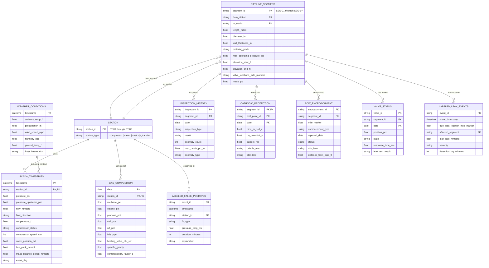

# Pipeline Integrity Agent — Data Model

This document describes the complete data model for the Pipeline Leak Detection & Integrity Agent, covering all datasets, their schemas, relationships, and usage within the system.

---

## Entity Relationship Diagram

---

## Entities

### 1. SCADA Timeseries (`scada_timeseries.csv`)

Real-time telemetry from 8 monitoring stations sampled every 5 minutes. This is the primary data source for leak detection.

| Column | Type | Description |
|--------|------|-------------|
| `timestamp` | ISO 8601 datetime | Measurement time (5-min intervals) |
| `station_id` | string | Station identifier (ST-01 through ST-08) |
| `station_type` | enum | `compressor` \| `meter` \| `custody_transfer` |
| `pressure_psi` | float | Current pipeline pressure at station |
| `pressure_upstream_psi` | float | Pressure reading from upstream sensor |
| `flow_mmscfd` | float | Gas flow rate in million standard cubic feet/day |
| `flow_direction` | enum | `inlet` \| `outlet` |
| `temperature_f` | float | Gas temperature in Fahrenheit |
| `compressor_status` | enum | `running` \| `standby` \| `shutdown` |
| `compressor_speed_rpm` | int | Compressor rotational speed (0 if standby) |
| `valve_position_pct` | float | Main valve opening percentage (0–100) |
| `line_pack_mmscf` | float | Gas stored in pipeline segment |
| `mass_balance_deficit_mmscfd` | float | Difference between inlet and outlet flow (leak indicator) |
| `event_flag` | enum | `normal` \| `compressor_start` \| `valve_change` \| `leak` \| `false_positive` |

Primary key: `(timestamp, station_id)`
Relationships: `station_id` links to all station-level entities.

---

### 2. Pipeline Segment Metadata (`pipeline_segment_metadata.csv`)

Physical characteristics of the 7 pipeline segments connecting the 8 stations. Total pipeline length: ~200 miles.

| Column | Type | Description |
|--------|------|-------------|
| `segment_id` | string | Segment identifier (SEG-01 through SEG-07) |
| `from_station` | string | Upstream station ID |
| `to_station` | string | Downstream station ID |
| `length_miles` | float | Segment length in miles |
| `diameter_in` | float | Pipe outer diameter in inches |
| `wall_thickness_in` | float | Pipe wall thickness in inches |
| `material_grade` | string | Steel grade (e.g., X65) |
| `max_operating_pressure_psi` | float | Maximum allowable operating pressure |
| `elevation_start_ft` | float | Elevation at upstream station |
| `elevation_end_ft` | float | Elevation at downstream station |
| `valve_locations_mile_markers` | string (CSV) | Comma-separated mile markers of isolation valves |
| `maop_psi` | float | Maximum Allowable Operating Pressure |

Primary key: `segment_id`
Relationships: `from_station` and `to_station` reference station IDs.

---

### 3. Inspection History (`inspection_history.csv`)

Historical inline inspection (ILI) and external inspection records for integrity management.

| Column | Type | Description |
|--------|------|-------------|
| `inspection_id` | string | Unique inspection identifier (INS-XXXX) |
| `segment_id` | string | Pipeline segment inspected |
| `date` | date | Inspection date (YYYY-MM-DD) |
| `inspection_type` | enum | `ILI UT` \| `ILI MFL` \| `External Visual` \| `Hydrostatic Test` \| `Close Interval Survey` |
| `result` | enum | `Pass` \| `Anomaly Found` \| `Repair Required` |
| `anomaly_count` | int | Number of anomalies detected |
| `max_depth_pct_wt` | float (nullable) | Maximum anomaly depth as % of wall thickness |
| `anomaly_type` | enum | `Dent` \| `Gouge` \| `Weld Anomaly` \| `None` |

Primary key: `inspection_id`
Foreign key: `segment_id` → Pipeline Segment Metadata

---

### 4. Labeled Leak Events (`labeled_leak_events.csv`)

Ground-truth confirmed leak events used for agent evaluation and benchmarking.

| Column | Type | Description |
|--------|------|-------------|
| `event_id` | string | Leak event identifier (LK-XXX) |
| `onset_timestamp` | ISO 8601 datetime | When the leak actually started |
| `true_leak_location_mile_marker` | float | Confirmed leak location (mile marker) |
| `affected_segment` | string | Pipeline segment where leak occurred |
| `leak_rate_mmscfd` | float | Confirmed leak rate |
| `severity` | enum | `seep` \| `moderate` \| `significant` \| `near_rupture` |
| `detection_lag_minutes` | int | Time between onset and agent detection |

Primary key: `event_id`
Foreign key: `affected_segment` → Pipeline Segment Metadata

---

### 5. Labeled False Positive Events (`labeled_false_positive_events.csv`)

Confirmed non-leak events that mimic leak signatures. Used to evaluate the agent's disambiguation accuracy.

| Column | Type | Description |
|--------|------|-------------|
| `event_id` | string | False positive identifier (FP-XXX) |
| `timestamp` | ISO 8601 datetime | When the event occurred |
| `station_id` | string | Station where the event was observed |
| `fp_type` | enum | `compressor_start` \| `temperature_line_pack` \| `valve_change` |
| `pressure_drop_psi` | float | Magnitude of pressure drop |
| `duration_minutes` | int | How long the anomalous signature lasted |
| `explanation` | string | Human-written explanation of root cause |

Primary key: `event_id`
Foreign key: `station_id` → Station

---

### 6. Cathodic Protection (`cathodic_protection.csv`)

Corrosion protection monitoring data from test points along each segment.

| Column | Type | Description |
|--------|------|-------------|
| `segment_id` | string | Pipeline segment |
| `test_point_id` | string | Test point identifier (TP-XX-X) |
| `date` | date | Measurement date |
| `pipe_to_soil_v` | float | Pipe-to-soil potential in volts |
| `on_potential_v` | float | On-potential reading in volts |
| `current_ma` | float | Protection current in milliamps |
| `criteria_met` | enum | `Pass` \| `Fail` |
| `standard` | string | Compliance standard (e.g., NACE SP0169) |

Primary key: `(segment_id, test_point_id, date)`
Foreign key: `segment_id` → Pipeline Segment Metadata

---

### 7. Gas Composition (`gas_composition.csv`)

Weekly gas chromatograph analysis at each station. Used for flow calculation accuracy and safety monitoring.

| Column | Type | Description |
|--------|------|-------------|
| `date` | date | Sample date |
| `station_id` | string | Station where sample was taken |
| `methane_pct` | float | Methane concentration (%) |
| `ethane_pct` | float | Ethane concentration (%) |
| `propane_pct` | float | Propane concentration (%) |
| `co2_pct` | float | Carbon dioxide concentration (%) |
| `n2_pct` | float | Nitrogen concentration (%) |
| `h2s_ppm` | float | Hydrogen sulfide in parts per million |
| `heating_value_btu_scf` | float | Energy content (BTU per standard cubic foot) |
| `specific_gravity` | float | Gas specific gravity relative to air |
| `compressibility_factor_z` | float | Z-factor for real gas behavior |

Primary key: `(date, station_id)`
Foreign key: `station_id` → Station

---

### 8. ROW Encroachment (`row_encroachment.csv`)

Right-of-Way encroachment events that represent third-party activity near the pipeline.

| Column | Type | Description |
|--------|------|-------------|
| `encroachment_id` | string | Encroachment identifier (ENC-XXX) |
| `segment_id` | string | Affected pipeline segment |
| `mile_marker` | float | Location along the segment |
| `encroachment_type` | enum | `Road Crossing` \| `Construction` \| `Agricultural` \| `Residential Development` \| `Utility Crossing` \| `Excavation` |
| `reported_date` | date | Date encroachment was reported |
| `status` | enum | `Open` \| `Monitoring` \| `Closed` |
| `risk_level` | enum | `Low` \| `Medium` \| `High` |
| `distance_from_pipe_ft` | float | Distance from pipeline centerline in feet |

Primary key: `encroachment_id`
Foreign key: `segment_id` → Pipeline Segment Metadata

---

### 9. Valve Status (`valve_status.csv`)

Periodic valve health and position data for isolation valves along the pipeline.

| Column | Type | Description |
|--------|------|-------------|
| `valve_id` | string | Valve identifier (V-XX-X) |
| `segment_id` | string | Segment the valve belongs to (numeric, e.g., "01") |
| `date` | date | Status check date |
| `position_pct` | float | Valve opening percentage |
| `state` | enum | `Open` \| `Closed` |
| `response_time_sec` | float | Time to actuate in seconds |
| `leak_test_result` | enum | `Pass` \| `Fail` |

Primary key: `(valve_id, date)`
Foreign key: `segment_id` → Pipeline Segment Metadata (note: uses numeric ID without "SEG-" prefix)

---

### 10. Weather Conditions (`weather_conditions.csv`)

Hourly environmental conditions along the pipeline corridor. Used for false positive disambiguation (temperature-driven line pack changes).

| Column | Type | Description |
|--------|------|-------------|
| `timestamp` | ISO 8601 datetime | Measurement time (hourly) |
| `ambient_temp_f` | float | Air temperature in Fahrenheit |
| `precipitation_in` | float | Precipitation in inches |
| `wind_speed_mph` | float | Wind speed in miles per hour |
| `humidity_pct` | float | Relative humidity percentage |
| `ground_temp_f` | float | Ground temperature in Fahrenheit |
| `frost_heave_risk` | enum | `Yes` \| `No` |

Primary key: `timestamp`

---

## Data Relationships Summary

| Relationship | From | To | Join Key |
|---|---|---|---|
| Station telemetry | SCADA Timeseries | Station (implicit) | `station_id` |
| Segment boundaries | Pipeline Segments | Station | `from_station`, `to_station` |
| Segment inspections | Inspection History | Pipeline Segments | `segment_id` |
| Corrosion monitoring | Cathodic Protection | Pipeline Segments | `segment_id` |
| Encroachment tracking | ROW Encroachment | Pipeline Segments | `segment_id` |
| Valve health | Valve Status | Pipeline Segments | `segment_id` |
| Gas quality | Gas Composition | Station | `station_id` |
| Leak ground truth | Labeled Leak Events | Pipeline Segments | `affected_segment` |
| FP ground truth | Labeled False Positives | Station | `station_id` |
| Environmental context | Weather Conditions | Global (all stations) | `timestamp` (temporal join) |

---

## Temporal Resolution

| Dataset | Frequency | Time Range |
|---------|-----------|------------|
| SCADA Timeseries | 5 minutes | Dec 2025 – Feb 2026 |
| Weather Conditions | 1 hour | Dec 2025 – Feb 2026 |
| Gas Composition | Weekly | Dec 2025 – Feb 2026 |
| Valve Status | Daily | Dec 2025 |
| Cathodic Protection | Semi-annual | Jun 2025 |
| Inspection History | Irregular | 2020 – 2025 |
| ROW Encroachment | Event-driven | 2025 |
| Labeled Leak Events | Event-driven | Dec 2025 – Feb 2026 |
| Labeled False Positives | Event-driven | Dec 2025 – Jan 2026 |

---

## Usage in Agent Reasoning

| Agent Task | Primary Data | Supporting Data |
|---|---|---|
| Anomaly detection | SCADA Timeseries | Weather, Gas Composition |
| False positive disambiguation | SCADA Timeseries, False Positive Events | Weather, Valve Status |
| Leak localization | SCADA Timeseries, Pipeline Segments | — |
| Severity classification | SCADA Timeseries, Labeled Leak Events | — |
| Integrity risk assessment | Inspection History, Cathodic Protection | ROW Encroachment |
| Incident response | Pipeline Segments, Valve Status | ROW Encroachment |
